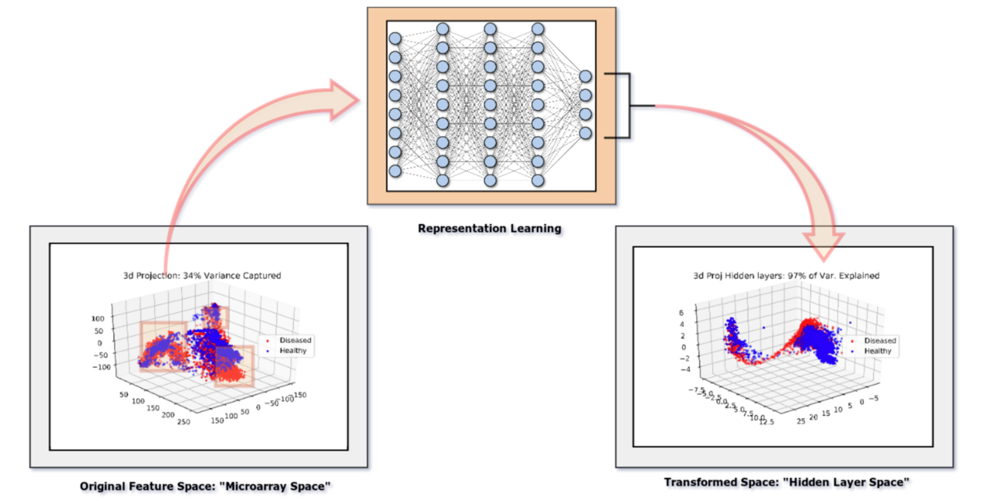
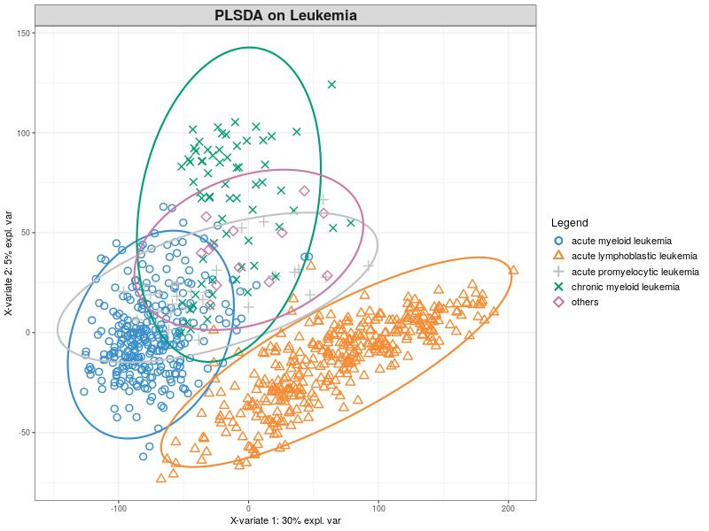

This is my final project for the SJTU Bioinformatics class. We were asked to do data analysis on microarray gene expression data; however most traditional machine learning methods fail with this data set because n << p. For example, PCA is a terrible approximation to the real covariance of the data, neural networks overfit… We applied sparse PLSDA and Neural Networks to finesse the task. 

I will not go into all the details, but we built a classifier that was 100% accurate in classifying all 5 major different types of leukemia, the reader can have a look at the slides or the report for an in-depth explanation.

